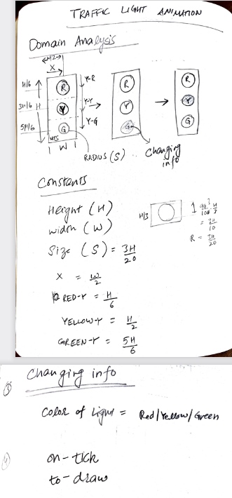
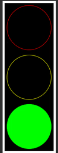

Once we understand how to design data and functions, we can use this knowledge to build animation programs. Animation programs typically involve designing one or more data definitions and certainly more than one function. Just like designing functions becomes easier when following a [recipe](../b95), having a recipe for designing world programs is an effective approach. Method for designing animation program is divided into two phases - analysis phase, where one thinks through the design without writing any code and coding phase, where you use analysis to actually build the program. 

**Note:** This recipe is taken from UBC EdX Course: [How to Code: Simple Data](https://learning.edx.org/course/course-v1:UBCx+HtC1x+2T2017/home)

### Domain Analysis
**Step 1: Sketch program scenarios:**
In this step, we sketch some program scenarios on a piece of paper. Perhaps 2-3 prototype sketches illustrating the animation in different stages.

**Step 2: Identify constant information:**
Then we identify the information that stays constant. This could be the size of the canvas, images that don't change, background scenery etc.

**Step 3: Identify changing information:**
Then we identify information that changes. For example, the position of a character or score in a game.

**Step 4: Identify big-bang options:**
We then look at which functions are needed for our animation to run. Almost always one would need a render function (to display current state of the game) and a clock handler function which updates the game state after certain time interval. In addition we might need functions to handle interactivity through keyboard and mouse clicks.

### Building the Program

In the next phase we start writing code and this phase heavily borrows from the work done in domain analysis phase.

**Step 1: Define constants:**
First we develop constant definitions. Definitions needed directly follow from Step 2 of domain analysis.

**Step 2: Define data:**
Using Step 3 of domain analysis, we develop data definitions.

**Step 3: Create wish list of functions:**
Step 4 of domain analysis helps us write wish-list of functions.

**Step 4: Work through the wish list:**
We start to work on our wish list until no wish remains.

### Putting it Together - Animation of Traffic Light

Let's see how we can use the above method to design animation of a traffic light. As you can see below, our domain analysis involves constants for the traffic light as well as three pictures representing particular color light being lit. Also note that there are two big-bang options `on-tick` and `to-draw` but the final program has helper functions to help these functions do their job. 

 

This allows us to develop our data definitions like so:

```racket
;; Constants
(define HEIGHT 600)
(define WIDTH (/ HEIGHT 3))
(define SIZE (/ (* 3 HEIGHT) 20))
(define X (/ WIDTH 2))
(define RED-Y (/ HEIGHT 6))
(define YELLOW-Y (/ HEIGHT 2))
(define GREEN-Y (/ (* 5 HEIGHT) 6))

(define MTS (empty-scene WIDTH HEIGHT 'black))
;; TrafficLight -> Image
;; produce a circle of radius SIZE and color of given traffic light
(define (make-light tl)
  (circle SIZE 'outline tl))

(check-equal? (make-light 'green)
              (circle SIZE 'outline 'green))

(define FRAME (place-image
               (make-light 'red) X RED-Y
               (place-image
                (make-light 'yellow) X YELLOW-Y
                (place-image
                 (make-light 'green) X GREEN-Y MTS))))
```
Then we model the data as enumeration:
```racket
;; Data
;; TrafficLight is one of:
;;  - 'red
;;  - 'yellow
;;  - 'green
;; inerp. color of a traffic light

```

We then start to write our functions:

```racket
;; Functions
;; Color Number -> Image
;; produce the image of solid circle the given color at given y-position
;;  onto the FRAME
(define (display-light tl y)
  (place-image (circle SIZE 'solid tl)
                           X
                           y
                           FRAME))

(check-equal? (display-light 'yellow YELLOW-Y)
              (place-image (circle SIZE 'solid 'yellow)
                           X
                           YELLOW-Y
                           FRAME))


;; TrafficLight -> Image
;; display the color of the given light as ON in the light frame
(define (render-light tl)
  (cond [(symbol=? tl 'red) (display-light 'red RED-Y)]
        [(symbol=? tl 'yellow) (display-light 'yellow YELLOW-Y)]
        [(symbol=? tl 'green) (display-light 'green GREEN-Y)]))

(check-equal? (render-light 'yellow)
              (place-image (circle SIZE 'solid 'yellow)
                           X
                           YELLOW-Y
                           FRAME))


;; TrafficLight -> TrafficLight
;; produce the next color of the light given the current color
;;  red -> green
;;  green -> yellow
;;  yellow -> red
(define (next-light tl)
  (cond [(symbol=? tl 'red) 'green]
        [(symbol=? tl 'yellow) 'red]
        [(symbol=? tl 'green) 'yellow]))

(check-equal? (next-light 'green) 'yellow)
(check-equal? (next-light 'yellow) 'red)
(check-equal? (next-light 'red) 'green)


;; TrafficLight -> TrafficLight
;; Start simulation with (main 'red)
(define (main tl)
  (big-bang
      tl
    (to-draw render-light)
    (on-tick next-light 5)))
```

## Animation
Here is the final anilmated traffic light!

