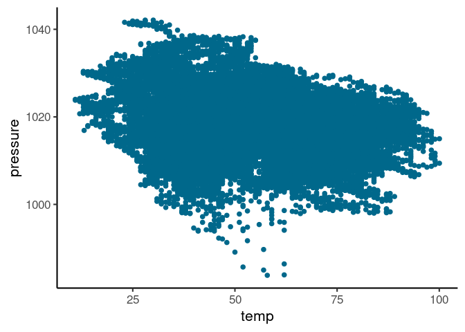

Scatterplot is a good choice for plotting two continuous variable. It
helps to visualize any interesting relationship between the two variables.
Some of the information however could be masked due to **overplotting**.
Overplotting refers to situation when multiple data points are plotted at the
same location on the plot confounding some of the
data points. Overplotting can occur due to:

1.  Large number of data points
2.  While the scale is continuous, the values available for the variable
    are actually discrete.

## Solution: Choosing more appropriate aesthetics for the point

Solution in these cases is to adjust the aesthetics of the point like
color, size and alpha values.

### Less number of points

For few hundred points, large size, bright colors and no transparency is
useful for the most part. In the following dataset, we have a little
over a hundred data points, so we chose dark green solid circle of size
4.

```R
air = datasets::airquality
plt = ggplot(air, aes(Wind, Ozone))
plt + geom_point(color = 'darkgreen', size = 4)
```


For even smaller number of points, I like to use larger circle with
darker border and (somewhat) lighter color.

```R
cars = datasets::cars
plt = ggplot(cars, aes(speed, dist))
plt + geom_point(color = 'darkred', size = 3, shape = 21, stroke = 2, fill = 'pink')
```


### Large number of points

In the data below, we have over 20,000 observations, so using solid
circles masks most of the data making it harder to see any trend or data
density information.

```R
nyc = nycflights13::weather
plt2 = ggplot(nyc, aes(temp, pressure))
plt2 + geom_point(size = 2, shape = 19, alpha = 1, color = 'deepskyblue4')
```



So we could either set the alpha to a very low value:

```R
plt2 + geom_point(size = 1,alpha = 0.1, color = 'deepskyblue3')
```


Or just represent data with a dot instead of circle:

```R
plt2 + geom_point(shape = '.', color = 'red')
```


The above two plots represent the second problem highlighted earlier
with vertical lines showing the discrete steps in temperature. One could
use `geom_jitter` to add some noise to the data. Note that this is
purely for visualizing data density and I think it is important to
highlight this if sharing such a visualization with your collaborators
or readers.

```R
plt2 + geom_jitter(shape = '.', color = 'red')
```


