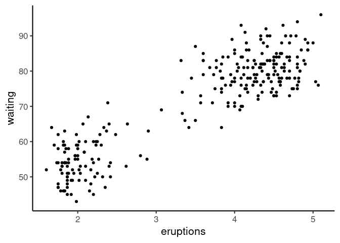
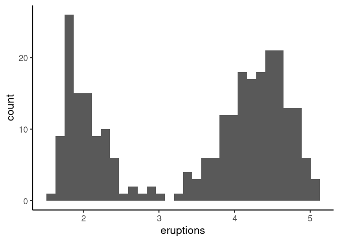
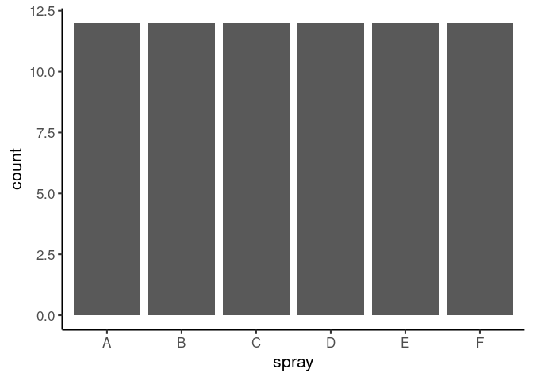
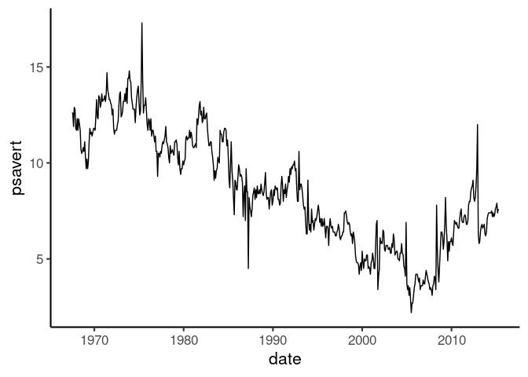

When constructing a data graphics using [grammer of
graphics](https://vita.had.co.nz/papers/layered-grammar.pdf), it’s worth
noting there there are three key ingredients:

1.  **Data**: Can’t do much of a data graphics without data.
2.  **Axis Mapping**: Pick one or two variables from data and map those
    to axes (x, y or both x & y).
3.  **Geometrical Element**: Select an appropriate geometrical element
    to *visually* display the data.

Thinking in this way give us a good starting point to build common plots
but more importantly, it provides a flexible framework to construct the
plots we want. This is what I slowly will attempt to learn.

Let’s see how these elements come together using some examples:

### Scatter Plot

For scatter plot, we need two numerical variables.

-   **Data**: Old faithful
-   **Axis**: x = eruptions, y = waiting
-   **Geometrical Element**: point

``` r
ggplot(faithful, aes(eruptions, waiting)) +
  geom_point()
```



### Histogram

For histogram, we need one numerical variable.

-   **Data**: Old faithful
-   **Axis**: x = eruptions
-   **Geometrical Element**: histogram

``` r
ggplot(faithful, aes(eruptions)) +
  geom_histogram()
```



### Bar chart

Bar chart has one categorical variable and the each bar’s height
represents the count for each category.

-   **Data**: InsectSprays
-   **Axis**: x = spray
-   **Geometrical Element**: bar

``` r
ggplot(InsectSprays, aes(spray)) +
  geom_bar()
```



### Time series

Time series is a plot of numeric variable as a function of time.

-   **Data**: ggplot2::economics
-   **Axis**: x = date, y = psavert (personal savings rate)
-   **Geometrical Element**: line

``` r
ggplot(economics, aes(date, psavert)) +
  geom_line()
```



