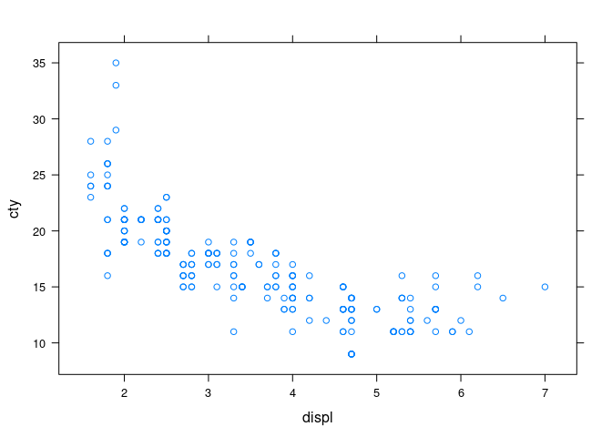
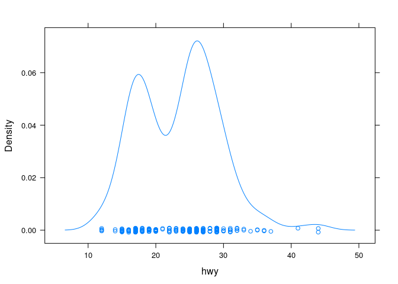

I am going to use `ggplot2::mpg` data set for demonstration of its data wrangling features. So let's first create a data.table from this data:

```r
library(data.table)
mpg <- data.table(ggplot2::mpg)
mpg
```

```
##      manufacturer  model displ year cyl      trans drv cty hwy fl   class
##   1:         audi     a4   1.8 1999   4   auto(l5)   f  18  29  p compact
##   2:         audi     a4   1.8 1999   4 manual(m5)   f  21  29  p compact
##   3:         audi     a4   2.0 2008   4 manual(m6)   f  20  31  p compact
##   4:         audi     a4   2.0 2008   4   auto(av)   f  21  30  p compact
##   5:         audi     a4   2.8 1999   6   auto(l5)   f  16  26  p compact
##  ---                                                                     
## 230:   volkswagen passat   2.0 2008   4   auto(s6)   f  19  28  p midsize
## 231:   volkswagen passat   2.0 2008   4 manual(m6)   f  21  29  p midsize
## 232:   volkswagen passat   2.8 1999   6   auto(l5)   f  16  26  p midsize
## 233:   volkswagen passat   2.8 1999   6 manual(m5)   f  18  26  p midsize
## 234:   volkswagen passat   3.6 2008   6   auto(s6)   f  17  26  p midsize
```

### Row Selection
**Select first row**

```r
mpg[1]
```

```
##    manufacturer model displ year cyl    trans drv cty hwy fl   class
## 1:         audi    a4   1.8 1999   4 auto(l5)   f  18  29  p compact
```

**Select first three rows**

```r
mpg[1:3]
```

```
##    manufacturer model displ year cyl      trans drv cty hwy fl   class
## 1:         audi    a4   1.8 1999   4   auto(l5)   f  18  29  p compact
## 2:         audi    a4   1.8 1999   4 manual(m5)   f  21  29  p compact
## 3:         audi    a4   2.0 2008   4 manual(m6)   f  20  31  p compact
```

**Select all but first three rows**

```r
mpg[-(1:3)]
```

```
##      manufacturer      model displ year cyl      trans drv cty hwy fl   class
##   1:         audi         a4   2.0 2008   4   auto(av)   f  21  30  p compact
##   2:         audi         a4   2.8 1999   6   auto(l5)   f  16  26  p compact
##   3:         audi         a4   2.8 1999   6 manual(m5)   f  18  26  p compact
##   4:         audi         a4   3.1 2008   6   auto(av)   f  18  27  p compact
##   5:         audi a4 quattro   1.8 1999   4 manual(m5)   4  18  26  p compact
##  ---                                                                         
## 227:   volkswagen     passat   2.0 2008   4   auto(s6)   f  19  28  p midsize
## 228:   volkswagen     passat   2.0 2008   4 manual(m6)   f  21  29  p midsize
## 229:   volkswagen     passat   2.8 1999   6   auto(l5)   f  16  26  p midsize
## 230:   volkswagen     passat   2.8 1999   6 manual(m5)   f  18  26  p midsize
## 231:   volkswagen     passat   3.6 2008   6   auto(s6)   f  17  26  p midsize
```

**Select rows five through seven but with order reversed**

```r
mpg[7:5]
```

```
##    manufacturer model displ year cyl      trans drv cty hwy fl   class
## 1:         audi    a4   3.1 2008   6   auto(av)   f  18  27  p compact
## 2:         audi    a4   2.8 1999   6 manual(m5)   f  18  26  p compact
## 3:         audi    a4   2.8 1999   6   auto(l5)   f  16  26  p compact
```

**Select the last row**

`.N` is a special symbol to get the number of rows in the data table:

```r
mpg[.N]
```

```
##    manufacturer  model displ year cyl    trans drv cty hwy fl   class
## 1:   volkswagen passat   3.6 2008   6 auto(s6)   f  17  26  p midsize
```

**Select all rows except the last row**

```r
mpg[-.N]
```

```
##      manufacturer  model displ year cyl      trans drv cty hwy fl   class
##   1:         audi     a4   1.8 1999   4   auto(l5)   f  18  29  p compact
##   2:         audi     a4   1.8 1999   4 manual(m5)   f  21  29  p compact
##   3:         audi     a4   2.0 2008   4 manual(m6)   f  20  31  p compact
##   4:         audi     a4   2.0 2008   4   auto(av)   f  21  30  p compact
##   5:         audi     a4   2.8 1999   6   auto(l5)   f  16  26  p compact
##  ---                                                                     
## 229:   volkswagen passat   1.8 1999   4   auto(l5)   f  18  29  p midsize
## 230:   volkswagen passat   2.0 2008   4   auto(s6)   f  19  28  p midsize
## 231:   volkswagen passat   2.0 2008   4 manual(m6)   f  21  29  p midsize
## 232:   volkswagen passat   2.8 1999   6   auto(l5)   f  16  26  p midsize
## 233:   volkswagen passat   2.8 1999   6 manual(m5)   f  18  26  p midsize
```

**Random 10 observations**

```r
mpg[sample(.N, 10)]
```

```
##     manufacturer                  model displ year cyl      trans drv cty hwy
##  1:      hyundai                tiburon   2.0 2008   4   auto(l4)   f  20  27
##  2:         ford                mustang   4.0 2008   6 manual(m5)   r  17  26
##  3:   volkswagen                  jetta   2.0 1999   4   auto(l4)   f  19  26
##  4:        honda                  civic   1.6 1999   4   auto(l4)   f  24  32
##  5:       toyota land cruiser wagon 4wd   4.7 1999   8   auto(l4)   4  11  15
##  6:        honda                  civic   1.6 1999   4   auto(l4)   f  24  32
##  7:      hyundai                tiburon   2.0 2008   4 manual(m5)   f  20  28
##  8:       nissan                 altima   2.4 1999   4   auto(l4)   f  19  27
##  9:      hyundai                 sonata   2.5 1999   6 manual(m5)   f  18  26
## 10:   volkswagen             new beetle   1.9 1999   4 manual(m5)   f  35  44
##     fl      class
##  1:  r subcompact
##  2:  r subcompact
##  3:  r    compact
##  4:  r subcompact
##  5:  r        suv
##  6:  r subcompact
##  7:  r subcompact
##  8:  r    compact
##  9:  r    midsize
## 10:  d subcompact
```

**Random 10% observations**

```r
mpg[sample(.N, (.N * 0.1))]
```

```
##     manufacturer               model displ year cyl      trans drv cty hwy fl
##  1:         ford             mustang   4.6 2008   8   auto(l5)   r  15  22  r
##  2:       toyota               camry   3.0 1999   6   auto(l4)   f  18  26  r
##  3:   land rover         range rover   4.2 2008   8   auto(s6)   4  12  18  r
##  4:   volkswagen               jetta   2.8 1999   6   auto(l4)   f  16  23  r
##  5:         audi          a4 quattro   2.0 2008   4   auto(s6)   4  19  27  p
##  6:       subaru         impreza awd   2.5 1999   4 manual(m5)   4  19  26  r
##  7:       subaru         impreza awd   2.5 2008   4   auto(s4)   4  20  27  r
##  8:        honda               civic   1.8 2008   4 manual(m5)   f  26  34  r
##  9:    chevrolet            corvette   6.2 2008   8   auto(s6)   r  15  25  p
## 10:         audi                  a4   1.8 1999   4   auto(l5)   f  18  29  p
## 11:      hyundai              sonata   3.3 2008   6   auto(l5)   f  19  28  r
## 12:   volkswagen          new beetle   1.9 1999   4 manual(m5)   f  35  44  d
## 13:      pontiac          grand prix   5.3 2008   8   auto(s4)   f  16  25  p
## 14:        dodge ram 1500 pickup 4wd   5.9 1999   8   auto(l4)   4  11  15  r
## 15:       toyota   toyota tacoma 4wd   2.7 1999   4   auto(l4)   4  16  20  r
## 16:       toyota   toyota tacoma 4wd   4.0 2008   6   auto(l5)   4  16  20  r
## 17:       toyota             corolla   1.8 1999   4 manual(m5)   f  26  35  r
## 18:   volkswagen               jetta   2.0 1999   4 manual(m5)   f  21  29  r
## 19:    chevrolet            corvette   5.7 1999   8   auto(l4)   r  15  23  p
## 20:         ford     f150 pickup 4wd   4.6 1999   8 manual(m5)   4  13  16  r
## 21:    chevrolet              malibu   2.4 2008   4   auto(l4)   f  22  30  r
## 22:         audi          a4 quattro   2.0 2008   4 manual(m6)   4  20  28  p
## 23:        honda               civic   1.8 2008   4   auto(l5)   f  25  36  r
##     manufacturer               model displ year cyl      trans drv cty hwy fl
##          class
##  1: subcompact
##  2:    midsize
##  3:        suv
##  4:    compact
##  5:    compact
##  6: subcompact
##  7:    compact
##  8: subcompact
##  9:    2seater
## 10:    compact
## 11:    midsize
## 12: subcompact
## 13:    midsize
## 14:     pickup
## 15:     pickup
## 16:     pickup
## 17:    compact
## 18:    compact
## 19:    2seater
## 20:     pickup
## 21:    midsize
## 22:    compact
## 23: subcompact
##          class
```

**Top 10 rows**

Any data.frame functions can directly be used because data.table is also a data.frame

```r
head(mpg, 10)
```

```
##     manufacturer      model displ year cyl      trans drv cty hwy fl   class
##  1:         audi         a4   1.8 1999   4   auto(l5)   f  18  29  p compact
##  2:         audi         a4   1.8 1999   4 manual(m5)   f  21  29  p compact
##  3:         audi         a4   2.0 2008   4 manual(m6)   f  20  31  p compact
##  4:         audi         a4   2.0 2008   4   auto(av)   f  21  30  p compact
##  5:         audi         a4   2.8 1999   6   auto(l5)   f  16  26  p compact
##  6:         audi         a4   2.8 1999   6 manual(m5)   f  18  26  p compact
##  7:         audi         a4   3.1 2008   6   auto(av)   f  18  27  p compact
##  8:         audi a4 quattro   1.8 1999   4 manual(m5)   4  18  26  p compact
##  9:         audi a4 quattro   1.8 1999   4   auto(l5)   4  16  25  p compact
## 10:         audi a4 quattro   2.0 2008   4 manual(m6)   4  20  28  p compact
```

**Bottom 10 rows**

```r
tail(mpg, 10)
```

```
##     manufacturer      model displ year cyl      trans drv cty hwy fl      class
##  1:   volkswagen new beetle   2.0 1999   4   auto(l4)   f  19  26  r subcompact
##  2:   volkswagen new beetle   2.5 2008   5 manual(m5)   f  20  28  r subcompact
##  3:   volkswagen new beetle   2.5 2008   5   auto(s6)   f  20  29  r subcompact
##  4:   volkswagen     passat   1.8 1999   4 manual(m5)   f  21  29  p    midsize
##  5:   volkswagen     passat   1.8 1999   4   auto(l5)   f  18  29  p    midsize
##  6:   volkswagen     passat   2.0 2008   4   auto(s6)   f  19  28  p    midsize
##  7:   volkswagen     passat   2.0 2008   4 manual(m6)   f  21  29  p    midsize
##  8:   volkswagen     passat   2.8 1999   6   auto(l5)   f  16  26  p    midsize
##  9:   volkswagen     passat   2.8 1999   6 manual(m5)   f  18  26  p    midsize
## 10:   volkswagen     passat   3.6 2008   6   auto(s6)   f  17  26  p    midsize
```

**Select all `a4` model observations**

```r
mpg[model == "a4"]
```

```
##    manufacturer model displ year cyl      trans drv cty hwy fl   class
## 1:         audi    a4   1.8 1999   4   auto(l5)   f  18  29  p compact
## 2:         audi    a4   1.8 1999   4 manual(m5)   f  21  29  p compact
## 3:         audi    a4   2.0 2008   4 manual(m6)   f  20  31  p compact
## 4:         audi    a4   2.0 2008   4   auto(av)   f  21  30  p compact
## 5:         audi    a4   2.8 1999   6   auto(l5)   f  16  26  p compact
## 6:         audi    a4   2.8 1999   6 manual(m5)   f  18  26  p compact
## 7:         audi    a4   3.1 2008   6   auto(av)   f  18  27  p compact
```

**Select all `6` cylinder `a4` models**

```r
mpg[model == "a4" & cyl == 6]
```

```
##    manufacturer model displ year cyl      trans drv cty hwy fl   class
## 1:         audi    a4   2.8 1999   6   auto(l5)   f  16  26  p compact
## 2:         audi    a4   2.8 1999   6 manual(m5)   f  18  26  p compact
## 3:         audi    a4   3.1 2008   6   auto(av)   f  18  27  p compact
```

**Select all non-`a4` model observations**

```r
mpg[model != "a4"]
```

```
##      manufacturer      model displ year cyl      trans drv cty hwy fl   class
##   1:         audi a4 quattro   1.8 1999   4 manual(m5)   4  18  26  p compact
##   2:         audi a4 quattro   1.8 1999   4   auto(l5)   4  16  25  p compact
##   3:         audi a4 quattro   2.0 2008   4 manual(m6)   4  20  28  p compact
##   4:         audi a4 quattro   2.0 2008   4   auto(s6)   4  19  27  p compact
##   5:         audi a4 quattro   2.8 1999   6   auto(l5)   4  15  25  p compact
##  ---                                                                         
## 223:   volkswagen     passat   2.0 2008   4   auto(s6)   f  19  28  p midsize
## 224:   volkswagen     passat   2.0 2008   4 manual(m6)   f  21  29  p midsize
## 225:   volkswagen     passat   2.8 1999   6   auto(l5)   f  16  26  p midsize
## 226:   volkswagen     passat   2.8 1999   6 manual(m5)   f  18  26  p midsize
## 227:   volkswagen     passat   3.6 2008   6   auto(s6)   f  17  26  p midsize
```

**Select all models except `a4` and `passat`**

```r
mpg[!model %in% c("a4", "passat")]
```

```
##      manufacturer      model displ year cyl      trans drv cty hwy fl
##   1:         audi a4 quattro   1.8 1999   4 manual(m5)   4  18  26  p
##   2:         audi a4 quattro   1.8 1999   4   auto(l5)   4  16  25  p
##   3:         audi a4 quattro   2.0 2008   4 manual(m6)   4  20  28  p
##   4:         audi a4 quattro   2.0 2008   4   auto(s6)   4  19  27  p
##   5:         audi a4 quattro   2.8 1999   6   auto(l5)   4  15  25  p
##  ---                                                                 
## 216:   volkswagen new beetle   1.9 1999   4   auto(l4)   f  29  41  d
## 217:   volkswagen new beetle   2.0 1999   4 manual(m5)   f  21  29  r
## 218:   volkswagen new beetle   2.0 1999   4   auto(l4)   f  19  26  r
## 219:   volkswagen new beetle   2.5 2008   5 manual(m5)   f  20  28  r
## 220:   volkswagen new beetle   2.5 2008   5   auto(s6)   f  20  29  r
##           class
##   1:    compact
##   2:    compact
##   3:    compact
##   4:    compact
##   5:    compact
##  ---           
## 216: subcompact
## 217: subcompact
## 218: subcompact
## 219: subcompact
## 220: subcompact
```

**Select models with city fuel economy more than 25 mpg**

```r
mpg[cty > 25]
```

```
##    manufacturer      model displ year cyl      trans drv cty hwy fl      class
## 1:        honda      civic   1.6 1999   4 manual(m5)   f  28  33  r subcompact
## 2:        honda      civic   1.8 2008   4 manual(m5)   f  26  34  r subcompact
## 3:       toyota    corolla   1.8 1999   4 manual(m5)   f  26  35  r    compact
## 4:       toyota    corolla   1.8 2008   4 manual(m5)   f  28  37  r    compact
## 5:       toyota    corolla   1.8 2008   4   auto(l4)   f  26  35  r    compact
## 6:   volkswagen      jetta   1.9 1999   4 manual(m5)   f  33  44  d    compact
## 7:   volkswagen new beetle   1.9 1999   4 manual(m5)   f  35  44  d subcompact
## 8:   volkswagen new beetle   1.9 1999   4   auto(l4)   f  29  41  d subcompact
```

**Select every other row**

```r
mpg[rep(c(TRUE, FALSE), length = .N)]
```

```
##      manufacturer      model displ year cyl      trans drv cty hwy fl
##   1:         audi         a4   1.8 1999   4   auto(l5)   f  18  29  p
##   2:         audi         a4   2.0 2008   4 manual(m6)   f  20  31  p
##   3:         audi         a4   2.8 1999   6   auto(l5)   f  16  26  p
##   4:         audi         a4   3.1 2008   6   auto(av)   f  18  27  p
##   5:         audi a4 quattro   1.8 1999   4   auto(l5)   4  16  25  p
##  ---                                                                 
## 113:   volkswagen new beetle   2.0 1999   4   auto(l4)   f  19  26  r
## 114:   volkswagen new beetle   2.5 2008   5   auto(s6)   f  20  29  r
## 115:   volkswagen     passat   1.8 1999   4   auto(l5)   f  18  29  p
## 116:   volkswagen     passat   2.0 2008   4 manual(m6)   f  21  29  p
## 117:   volkswagen     passat   2.8 1999   6 manual(m5)   f  18  26  p
##           class
##   1:    compact
##   2:    compact
##   3:    compact
##   4:    compact
##   5:    compact
##  ---           
## 113: subcompact
## 114: subcompact
## 115:    midsize
## 116:    midsize
## 117:    midsize
```

**Select `compact` vehicles for `2008` model year**

Multiple variables can be used with `on` argument


```r
mpg[.(2008, "compact"), on = c("year", "class")]
```

```
##     manufacturer        model displ year cyl      trans drv cty hwy fl   class
##  1:         audi           a4   2.0 2008   4 manual(m6)   f  20  31  p compact
##  2:         audi           a4   2.0 2008   4   auto(av)   f  21  30  p compact
##  3:         audi           a4   3.1 2008   6   auto(av)   f  18  27  p compact
##  4:         audi   a4 quattro   2.0 2008   4 manual(m6)   4  20  28  p compact
##  5:         audi   a4 quattro   2.0 2008   4   auto(s6)   4  19  27  p compact
##  6:         audi   a4 quattro   3.1 2008   6   auto(s6)   4  17  25  p compact
##  7:         audi   a4 quattro   3.1 2008   6 manual(m6)   4  15  25  p compact
##  8:       subaru  impreza awd   2.5 2008   4   auto(s4)   4  20  25  p compact
##  9:       subaru  impreza awd   2.5 2008   4   auto(s4)   4  20  27  r compact
## 10:       subaru  impreza awd   2.5 2008   4 manual(m5)   4  19  25  p compact
## 11:       subaru  impreza awd   2.5 2008   4 manual(m5)   4  20  27  r compact
## 12:       toyota camry solara   2.4 2008   4 manual(m5)   f  21  31  r compact
## 13:       toyota camry solara   2.4 2008   4   auto(s5)   f  22  31  r compact
## 14:       toyota camry solara   3.3 2008   6   auto(s5)   f  18  27  r compact
## 15:       toyota      corolla   1.8 2008   4 manual(m5)   f  28  37  r compact
## 16:       toyota      corolla   1.8 2008   4   auto(l4)   f  26  35  r compact
## 17:   volkswagen          gti   2.0 2008   4 manual(m6)   f  21  29  p compact
## 18:   volkswagen          gti   2.0 2008   4   auto(s6)   f  22  29  p compact
## 19:   volkswagen        jetta   2.0 2008   4   auto(s6)   f  22  29  p compact
## 20:   volkswagen        jetta   2.0 2008   4 manual(m6)   f  21  29  p compact
## 21:   volkswagen        jetta   2.5 2008   5   auto(s6)   f  21  29  r compact
## 22:   volkswagen        jetta   2.5 2008   5 manual(m5)   f  21  29  r compact
##     manufacturer        model displ year cyl      trans drv cty hwy fl   class
```

**Amongst `subcompact` and `midsize` vehicles of `1999` model year, what is the best highway fuel economy**

```r
mpg[.(1999, c("subcompact", "midsize")), min(hwy), on = c("year", "class")]
```

```
## [1] 21
```

**Select all observations with model name starting with *c* **

```r
mpg[grep("^c", model)]
```

```
##     manufacturer              model displ year cyl      trans drv cty hwy fl
##  1:    chevrolet c1500 suburban 2wd   5.3 2008   8   auto(l4)   r  14  20  r
##  2:    chevrolet c1500 suburban 2wd   5.3 2008   8   auto(l4)   r  11  15  e
##  3:    chevrolet c1500 suburban 2wd   5.3 2008   8   auto(l4)   r  14  20  r
##  4:    chevrolet c1500 suburban 2wd   5.7 1999   8   auto(l4)   r  13  17  r
##  5:    chevrolet c1500 suburban 2wd   6.0 2008   8   auto(l4)   r  12  17  r
##  6:    chevrolet           corvette   5.7 1999   8 manual(m6)   r  16  26  p
##  7:    chevrolet           corvette   5.7 1999   8   auto(l4)   r  15  23  p
##  8:    chevrolet           corvette   6.2 2008   8 manual(m6)   r  16  26  p
##  9:    chevrolet           corvette   6.2 2008   8   auto(s6)   r  15  25  p
## 10:    chevrolet           corvette   7.0 2008   8 manual(m6)   r  15  24  p
## 11:        dodge        caravan 2wd   2.4 1999   4   auto(l3)   f  18  24  r
## 12:        dodge        caravan 2wd   3.0 1999   6   auto(l4)   f  17  24  r
## 13:        dodge        caravan 2wd   3.3 1999   6   auto(l4)   f  16  22  r
## 14:        dodge        caravan 2wd   3.3 1999   6   auto(l4)   f  16  22  r
## 15:        dodge        caravan 2wd   3.3 2008   6   auto(l4)   f  17  24  r
## 16:        dodge        caravan 2wd   3.3 2008   6   auto(l4)   f  17  24  r
## 17:        dodge        caravan 2wd   3.3 2008   6   auto(l4)   f  11  17  e
## 18:        dodge        caravan 2wd   3.8 1999   6   auto(l4)   f  15  22  r
## 19:        dodge        caravan 2wd   3.8 1999   6   auto(l4)   f  15  21  r
## 20:        dodge        caravan 2wd   3.8 2008   6   auto(l6)   f  16  23  r
## 21:        dodge        caravan 2wd   4.0 2008   6   auto(l6)   f  16  23  r
## 22:        honda              civic   1.6 1999   4 manual(m5)   f  28  33  r
## 23:        honda              civic   1.6 1999   4   auto(l4)   f  24  32  r
## 24:        honda              civic   1.6 1999   4 manual(m5)   f  25  32  r
## 25:        honda              civic   1.6 1999   4 manual(m5)   f  23  29  p
## 26:        honda              civic   1.6 1999   4   auto(l4)   f  24  32  r
## 27:        honda              civic   1.8 2008   4 manual(m5)   f  26  34  r
## 28:        honda              civic   1.8 2008   4   auto(l5)   f  25  36  r
## 29:        honda              civic   1.8 2008   4   auto(l5)   f  24  36  c
## 30:        honda              civic   2.0 2008   4 manual(m6)   f  21  29  p
## 31:       toyota              camry   2.2 1999   4 manual(m5)   f  21  29  r
## 32:       toyota              camry   2.2 1999   4   auto(l4)   f  21  27  r
## 33:       toyota              camry   2.4 2008   4 manual(m5)   f  21  31  r
## 34:       toyota              camry   2.4 2008   4   auto(l5)   f  21  31  r
## 35:       toyota              camry   3.0 1999   6   auto(l4)   f  18  26  r
## 36:       toyota              camry   3.0 1999   6 manual(m5)   f  18  26  r
## 37:       toyota              camry   3.5 2008   6   auto(s6)   f  19  28  r
## 38:       toyota       camry solara   2.2 1999   4   auto(l4)   f  21  27  r
## 39:       toyota       camry solara   2.2 1999   4 manual(m5)   f  21  29  r
## 40:       toyota       camry solara   2.4 2008   4 manual(m5)   f  21  31  r
## 41:       toyota       camry solara   2.4 2008   4   auto(s5)   f  22  31  r
## 42:       toyota       camry solara   3.0 1999   6   auto(l4)   f  18  26  r
## 43:       toyota       camry solara   3.0 1999   6 manual(m5)   f  18  26  r
## 44:       toyota       camry solara   3.3 2008   6   auto(s5)   f  18  27  r
## 45:       toyota            corolla   1.8 1999   4   auto(l3)   f  24  30  r
## 46:       toyota            corolla   1.8 1999   4   auto(l4)   f  24  33  r
## 47:       toyota            corolla   1.8 1999   4 manual(m5)   f  26  35  r
## 48:       toyota            corolla   1.8 2008   4 manual(m5)   f  28  37  r
## 49:       toyota            corolla   1.8 2008   4   auto(l4)   f  26  35  r
##     manufacturer              model displ year cyl      trans drv cty hwy fl
##          class
##  1:        suv
##  2:        suv
##  3:        suv
##  4:        suv
##  5:        suv
##  6:    2seater
##  7:    2seater
##  8:    2seater
##  9:    2seater
## 10:    2seater
## 11:    minivan
## 12:    minivan
## 13:    minivan
## 14:    minivan
## 15:    minivan
## 16:    minivan
## 17:    minivan
## 18:    minivan
## 19:    minivan
## 20:    minivan
## 21:    minivan
## 22: subcompact
## 23: subcompact
## 24: subcompact
## 25: subcompact
## 26: subcompact
## 27: subcompact
## 28: subcompact
## 29: subcompact
## 30: subcompact
## 31:    midsize
## 32:    midsize
## 33:    midsize
## 34:    midsize
## 35:    midsize
## 36:    midsize
## 37:    midsize
## 38:    compact
## 39:    compact
## 40:    compact
## 41:    compact
## 42:    compact
## 43:    compact
## 44:    compact
## 45:    compact
## 46:    compact
## 47:    compact
## 48:    compact
## 49:    compact
##          class
```

**First row of `2008` model year `compact` vehicles**

`mult` argument can be used to get first/last observation in a sub-group


```r
mpg[.(2008, "compact"), mult = "first", on = c("year", "class")]
```

```
##    manufacturer model displ year cyl      trans drv cty hwy fl   class
## 1:         audi    a4     2 2008   4 manual(m6)   f  20  31  p compact
```

**Last row of `1999` model year `SUVs`**

```r
mpg[.(1999, "suv"), mult = "last", on = c("year", "class")]
```

```
##    manufacturer                  model displ year cyl    trans drv cty hwy fl
## 1:       toyota land cruiser wagon 4wd   4.7 1999   8 auto(l4)   4  11  15  r
##    class
## 1:   suv
```

**First row of all three subgroups: `4, 5 and 6` cylinder rear wheel drive cars**

```r
mpg[.(c(4, 5, 6), "r"), mult = "first", on = c("cyl", "drv")]
```

```
##    manufacturer   model displ year cyl      trans drv cty hwy   fl      class
## 1:         <NA>    <NA>    NA   NA   4       <NA>   r  NA  NA <NA>       <NA>
## 2:         <NA>    <NA>    NA   NA   5       <NA>   r  NA  NA <NA>       <NA>
## 3:         ford mustang   3.8 1999   6 manual(m5)   r  18  26    r subcompact
```

**First row of all three subgroups: `4, 5 and 6` cylinder rear wheel drive cars, but matching rows only**

`nomatch = 0L` can be used to show only matching rows


```r
mpg[.(c(4, 5, 6), "r"), mult = "first", nomatch = 0L, on = c("cyl", "drv")]
```

```
##    manufacturer   model displ year cyl      trans drv cty hwy fl      class
## 1:         ford mustang   3.8 1999   6 manual(m5)   r  18  26  r subcompact
```

**First row of each class**

`.SD` can be used to select all columns


```r
mpg[, head(.SD, 1), by = class]
```

```
##         class manufacturer              model displ year cyl      trans drv cty
## 1:    compact         audi                 a4   1.8 1999   4   auto(l5)   f  18
## 2:    midsize         audi         a6 quattro   2.8 1999   6   auto(l5)   4  15
## 3:        suv    chevrolet c1500 suburban 2wd   5.3 2008   8   auto(l4)   r  14
## 4:    2seater    chevrolet           corvette   5.7 1999   8 manual(m6)   r  16
## 5:    minivan        dodge        caravan 2wd   2.4 1999   4   auto(l3)   f  18
## 6:     pickup        dodge  dakota pickup 4wd   3.7 2008   6 manual(m6)   4  15
## 7: subcompact         ford            mustang   3.8 1999   6 manual(m5)   r  18
##    hwy fl
## 1:  29  p
## 2:  24  p
## 3:  20  r
## 4:  26  p
## 5:  24  r
## 6:  19  r
## 7:  26  r
```

**Last row of each class**

```r
mpg[, tail(.SD, 1), by = class]
```

```
##         class manufacturer                  model displ year cyl      trans drv
## 1:    compact   volkswagen                  jetta   2.8 1999   6 manual(m5)   f
## 2:    midsize   volkswagen                 passat   3.6 2008   6   auto(s6)   f
## 3:        suv       toyota land cruiser wagon 4wd   5.7 2008   8   auto(s6)   4
## 4:    2seater    chevrolet               corvette   7.0 2008   8 manual(m6)   r
## 5:    minivan        dodge            caravan 2wd   4.0 2008   6   auto(l6)   f
## 6:     pickup       toyota      toyota tacoma 4wd   4.0 2008   6   auto(l5)   4
## 7: subcompact   volkswagen             new beetle   2.5 2008   5   auto(s6)   f
##    cty hwy fl
## 1:  17  24  r
## 2:  17  26  p
## 3:  13  18  r
## 4:  15  24  p
## 5:  16  23  r
## 6:  16  20  r
## 7:  20  29  r
```

**Five worst highway fuel economy vehicles**

```r
head(mpg[order(hwy)], 5)
```

```
##    manufacturer               model displ year cyl      trans drv cty hwy fl
## 1:        dodge   dakota pickup 4wd   4.7 2008   8   auto(l5)   4   9  12  e
## 2:        dodge         durango 4wd   4.7 2008   8   auto(l5)   4   9  12  e
## 3:        dodge ram 1500 pickup 4wd   4.7 2008   8   auto(l5)   4   9  12  e
## 4:        dodge ram 1500 pickup 4wd   4.7 2008   8 manual(m6)   4   9  12  e
## 5:         jeep  grand cherokee 4wd   4.7 2008   8   auto(l5)   4   9  12  e
##     class
## 1: pickup
## 2:    suv
## 3: pickup
## 4: pickup
## 5:    suv
```

**Five best highway fuel economy vehicles**

```r
head(mpg[order(-hwy)], 5)
```

```
##    manufacturer      model displ year cyl      trans drv cty hwy fl      class
## 1:   volkswagen      jetta   1.9 1999   4 manual(m5)   f  33  44  d    compact
## 2:   volkswagen new beetle   1.9 1999   4 manual(m5)   f  35  44  d subcompact
## 3:   volkswagen new beetle   1.9 1999   4   auto(l4)   f  29  41  d subcompact
## 4:       toyota    corolla   1.8 2008   4 manual(m5)   f  28  37  r    compact
## 5:        honda      civic   1.8 2008   4   auto(l5)   f  25  36  r subcompact
```

**Best fuel economy vehicle in each class**

```r
mpg[order(hwy), head(.SD, 1), by = class]
```

```
##         class manufacturer             model displ year cyl      trans drv cty
## 1:     pickup        dodge dakota pickup 4wd   4.7 2008   8   auto(l5)   4   9
## 2:        suv        dodge       durango 4wd   4.7 2008   8   auto(l5)   4   9
## 3:    minivan        dodge       caravan 2wd   3.3 2008   6   auto(l4)   f  11
## 4: subcompact         ford           mustang   5.4 2008   8 manual(m6)   r  14
## 5:    midsize         audi        a6 quattro   4.2 2008   8   auto(s6)   4  16
## 6:    2seater    chevrolet          corvette   5.7 1999   8   auto(l4)   r  15
## 7:    compact   volkswagen             jetta   2.8 1999   6   auto(l4)   f  16
##    hwy fl
## 1:  12  e
## 2:  12  e
## 3:  17  e
## 4:  20  p
## 5:  23  p
## 6:  23  p
## 7:  23  r
```

### Column (variable) Selection

**Select model, cyl, drv, hwy**

```r
mpg[, .(model, cyl, drv, hwy)]
```

```
##       model cyl drv hwy
##   1:     a4   4   f  29
##   2:     a4   4   f  29
##   3:     a4   4   f  31
##   4:     a4   4   f  30
##   5:     a4   6   f  26
##  ---                   
## 230: passat   4   f  28
## 231: passat   4   f  29
## 232: passat   6   f  26
## 233: passat   6   f  26
## 234: passat   6   f  26
```

**Select first three variables**

```r
mpg[, 1:3]
```

```
##      manufacturer  model displ
##   1:         audi     a4   1.8
##   2:         audi     a4   1.8
##   3:         audi     a4   2.0
##   4:         audi     a4   2.0
##   5:         audi     a4   2.8
##  ---                          
## 230:   volkswagen passat   2.0
## 231:   volkswagen passat   2.0
## 232:   volkswagen passat   2.8
## 233:   volkswagen passat   2.8
## 234:   volkswagen passat   3.6
```

**Select all but first three variables**

```r
mpg[, -(1:3)]
```

```
##      year cyl      trans drv cty hwy fl   class
##   1: 1999   4   auto(l5)   f  18  29  p compact
##   2: 1999   4 manual(m5)   f  21  29  p compact
##   3: 2008   4 manual(m6)   f  20  31  p compact
##   4: 2008   4   auto(av)   f  21  30  p compact
##   5: 1999   6   auto(l5)   f  16  26  p compact
##  ---                                           
## 230: 2008   4   auto(s6)   f  19  28  p midsize
## 231: 2008   4 manual(m6)   f  21  29  p midsize
## 232: 1999   6   auto(l5)   f  16  26  p midsize
## 233: 1999   6 manual(m5)   f  18  26  p midsize
## 234: 2008   6   auto(s6)   f  17  26  p midsize
```

**Select variables by first storing in a character vector**

```r
cols <- c("model", "cyl", "drv", "hwy")
mpg[, ..cols] # option 1
```

```
##       model cyl drv hwy
##   1:     a4   4   f  29
##   2:     a4   4   f  29
##   3:     a4   4   f  31
##   4:     a4   4   f  30
##   5:     a4   6   f  26
##  ---                   
## 230: passat   4   f  28
## 231: passat   4   f  29
## 232: passat   6   f  26
## 233: passat   6   f  26
## 234: passat   6   f  26
```

```r
mpg[, cols, with = FALSE] # option 2
```

```
##       model cyl drv hwy
##   1:     a4   4   f  29
##   2:     a4   4   f  29
##   3:     a4   4   f  31
##   4:     a4   4   f  30
##   5:     a4   6   f  26
##  ---                   
## 230: passat   4   f  28
## 231: passat   4   f  29
## 232: passat   6   f  26
## 233: passat   6   f  26
## 234: passat   6   f  26
```

**Select all but variables stored in a character vector**

```r
cols <- c("model", "cyl", "drv", "hwy")
mpg[, -..cols] # option 1
```

```
##      manufacturer displ year      trans cty fl   class
##   1:         audi   1.8 1999   auto(l5)  18  p compact
##   2:         audi   1.8 1999 manual(m5)  21  p compact
##   3:         audi   2.0 2008 manual(m6)  20  p compact
##   4:         audi   2.0 2008   auto(av)  21  p compact
##   5:         audi   2.8 1999   auto(l5)  16  p compact
##  ---                                                  
## 230:   volkswagen   2.0 2008   auto(s6)  19  p midsize
## 231:   volkswagen   2.0 2008 manual(m6)  21  p midsize
## 232:   volkswagen   2.8 1999   auto(l5)  16  p midsize
## 233:   volkswagen   2.8 1999 manual(m5)  18  p midsize
## 234:   volkswagen   3.6 2008   auto(s6)  17  p midsize
```

```r
mpg[, -cols, with = FALSE] # option 2
```

```
##      manufacturer displ year      trans cty fl   class
##   1:         audi   1.8 1999   auto(l5)  18  p compact
##   2:         audi   1.8 1999 manual(m5)  21  p compact
##   3:         audi   2.0 2008 manual(m6)  20  p compact
##   4:         audi   2.0 2008   auto(av)  21  p compact
##   5:         audi   2.8 1999   auto(l5)  16  p compact
##  ---                                                  
## 230:   volkswagen   2.0 2008   auto(s6)  19  p midsize
## 231:   volkswagen   2.0 2008 manual(m6)  21  p midsize
## 232:   volkswagen   2.8 1999   auto(l5)  16  p midsize
## 233:   volkswagen   2.8 1999 manual(m5)  18  p midsize
## 234:   volkswagen   3.6 2008   auto(s6)  17  p midsize
```

**Select all variables in the range displ:drv**

```r
mpg[, displ:drv]
```

```
##      displ year cyl      trans drv
##   1:   1.8 1999   4   auto(l5)   f
##   2:   1.8 1999   4 manual(m5)   f
##   3:   2.0 2008   4 manual(m6)   f
##   4:   2.0 2008   4   auto(av)   f
##   5:   2.8 1999   6   auto(l5)   f
##  ---                              
## 230:   2.0 2008   4   auto(s6)   f
## 231:   2.0 2008   4 manual(m6)   f
## 232:   2.8 1999   6   auto(l5)   f
## 233:   2.8 1999   6 manual(m5)   f
## 234:   3.6 2008   6   auto(s6)   f
```

**Select all variables except those in the range displ:drv**

```r
mpg[, -(displ:drv)]
```

```
##      manufacturer  model cty hwy fl   class
##   1:         audi     a4  18  29  p compact
##   2:         audi     a4  21  29  p compact
##   3:         audi     a4  20  31  p compact
##   4:         audi     a4  21  30  p compact
##   5:         audi     a4  16  26  p compact
##  ---                                       
## 230:   volkswagen passat  19  28  p midsize
## 231:   volkswagen passat  21  29  p midsize
## 232:   volkswagen passat  16  26  p midsize
## 233:   volkswagen passat  18  26  p midsize
## 234:   volkswagen passat  17  26  p midsize
```

**Select all variables starting with *m* **

```r
cols <- grep("^m", names(mpg))
mpg[, ..cols]
```

```
##      manufacturer  model
##   1:         audi     a4
##   2:         audi     a4
##   3:         audi     a4
##   4:         audi     a4
##   5:         audi     a4
##  ---                    
## 230:   volkswagen passat
## 231:   volkswagen passat
## 232:   volkswagen passat
## 233:   volkswagen passat
## 234:   volkswagen passat
```

**Select all variables not starting with *m* **

```r
cols <- grep("^m", names(mpg))
mpg[, -..cols]
```

```
##      displ year cyl      trans drv cty hwy fl   class
##   1:   1.8 1999   4   auto(l5)   f  18  29  p compact
##   2:   1.8 1999   4 manual(m5)   f  21  29  p compact
##   3:   2.0 2008   4 manual(m6)   f  20  31  p compact
##   4:   2.0 2008   4   auto(av)   f  21  30  p compact
##   5:   2.8 1999   6   auto(l5)   f  16  26  p compact
##  ---                                                 
## 230:   2.0 2008   4   auto(s6)   f  19  28  p midsize
## 231:   2.0 2008   4 manual(m6)   f  21  29  p midsize
## 232:   2.8 1999   6   auto(l5)   f  16  26  p midsize
## 233:   2.8 1999   6 manual(m5)   f  18  26  p midsize
## 234:   3.6 2008   6   auto(s6)   f  17  26  p midsize
```

**Select all numeric columns **

```r
cols <- mpg[, sapply(.SD, is.numeric)]
mpg[, ..cols]
```

```
##      displ year cyl cty hwy
##   1:   1.8 1999   4  18  29
##   2:   1.8 1999   4  21  29
##   3:   2.0 2008   4  20  31
##   4:   2.0 2008   4  21  30
##   5:   2.8 1999   6  16  26
##  ---                       
## 230:   2.0 2008   4  19  28
## 231:   2.0 2008   4  21  29
## 232:   2.8 1999   6  16  26
## 233:   2.8 1999   6  18  26
## 234:   3.6 2008   6  17  26
```

**Select all non-numeric columns **

```r
cols <- mpg[, sapply(.SD, is.numeric)]
mpg[, -..cols]
```

```
##      manufacturer  model      trans drv fl   class
##   1:         audi     a4   auto(l5)   f  p compact
##   2:         audi     a4 manual(m5)   f  p compact
##   3:         audi     a4 manual(m6)   f  p compact
##   4:         audi     a4   auto(av)   f  p compact
##   5:         audi     a4   auto(l5)   f  p compact
##  ---                                              
## 230:   volkswagen passat   auto(s6)   f  p midsize
## 231:   volkswagen passat manual(m6)   f  p midsize
## 232:   volkswagen passat   auto(l5)   f  p midsize
## 233:   volkswagen passat manual(m5)   f  p midsize
## 234:   volkswagen passat   auto(s6)   f  p midsize
```

### Computing on J

**Number of observations**

```r
mpg[, .N]
```

```
## [1] 234
```

**Number of observations in each class**

```r
mpg[, .N, by = class]
```

```
##         class  N
## 1:    compact 47
## 2:    midsize 41
## 3:        suv 62
## 4:    2seater  5
## 5:    minivan 11
## 6:     pickup 33
## 7: subcompact 35
```

**Number of observations in each class, ordered alphabetically by class**

```r
mpg[, .N, keyby = class]
```

```
##         class  N
## 1:    2seater  5
## 2:    compact 47
## 3:    midsize 41
## 4:    minivan 11
## 5:     pickup 33
## 6: subcompact 35
## 7:        suv 62
```

**Mean city fuel economy for each class**

```r
mpg[, mean(cty), by = class]
```

```
##         class       V1
## 1:    compact 20.12766
## 2:    midsize 18.75610
## 3:        suv 13.50000
## 4:    2seater 15.40000
## 5:    minivan 15.81818
## 6:     pickup 13.00000
## 7: subcompact 20.37143
```

**Mean city fuel economy for each class and assign column name**

```r
mpg[, .(mean_city = mean(cty)), by = class]
```

```
##         class mean_city
## 1:    compact  20.12766
## 2:    midsize  18.75610
## 3:        suv  13.50000
## 4:    2seater  15.40000
## 5:    minivan  15.81818
## 6:     pickup  13.00000
## 7: subcompact  20.37143
```

**Mean city fuel economy for each class in increasing order**

```r
mpg[, .(mean_city = mean(cty)), keyby = class]
```

```
##         class mean_city
## 1:    2seater  15.40000
## 2:    compact  20.12766
## 3:    midsize  18.75610
## 4:    minivan  15.81818
## 5:     pickup  13.00000
## 6: subcompact  20.37143
## 7:        suv  13.50000
```

**Mean highway fuel economy for `honda` and `toyota` vehicles**

```r
mpg[manufacturer %in% c("honda", "toyota"), mean(hwy), by = manufacturer]
```

```
##    manufacturer       V1
## 1:        honda 32.55556
## 2:       toyota 24.91176
```

**Class of all variables, return as data table**

```r
mpg[, lapply(.SD, class)]
```

```
##    manufacturer     model   displ    year     cyl     trans       drv     cty
## 1:    character character numeric integer integer character character integer
##        hwy        fl     class
## 1: integer character character
```

**Class of all variables, return as vector**

```r
mpg[, sapply(.SD, class)]
```

```
## manufacturer        model        displ         year          cyl        trans 
##  "character"  "character"    "numeric"    "integer"    "integer"  "character" 
##          drv          cty          hwy           fl        class 
##  "character"    "integer"    "integer"  "character"  "character"
```

**Fraction of NA values for each variable**

```r
mpg[, lapply(.SD, function(x) mean(is.na(x)))]
```

```
##    manufacturer model displ year cyl trans drv cty hwy fl class
## 1:            0     0     0    0   0     0   0   0   0  0     0
```

**Mean of all numeric variables**

`.SDcols` can be used to apply a function to only subset of columns


```r
cols <- mpg[, sapply(.SD, is.numeric)]
mpg[, lapply(.SD, mean), .SDcols = cols]
```

```
##       displ   year      cyl      cty      hwy
## 1: 3.471795 2003.5 5.888889 16.85897 23.44017
```

**Change all non-numeric columns to upper case**

```r
cols <- mpg[, sapply(.SD, is.numeric)]
mpg[, lapply(.SD, toupper), .SDcols = -cols]
```

```
##      manufacturer  model      trans drv fl   class
##   1:         AUDI     A4   AUTO(L5)   F  P COMPACT
##   2:         AUDI     A4 MANUAL(M5)   F  P COMPACT
##   3:         AUDI     A4 MANUAL(M6)   F  P COMPACT
##   4:         AUDI     A4   AUTO(AV)   F  P COMPACT
##   5:         AUDI     A4   AUTO(L5)   F  P COMPACT
##  ---                                              
## 230:   VOLKSWAGEN PASSAT   AUTO(S6)   F  P MIDSIZE
## 231:   VOLKSWAGEN PASSAT MANUAL(M6)   F  P MIDSIZE
## 232:   VOLKSWAGEN PASSAT   AUTO(L5)   F  P MIDSIZE
## 233:   VOLKSWAGEN PASSAT MANUAL(M5)   F  P MIDSIZE
## 234:   VOLKSWAGEN PASSAT   AUTO(S6)   F  P MIDSIZE
```

**Number of vehicles with average fuel economy more than 25**

```r
mpg[, sum(((cty + hwy) / 2) > 25)]
```

```
## [1] 29
```

### More Expressions in J

**Scatterplot of city fuel economy versus displacement**

```r
mpg[, lattice::xyplot(cty ~ displ)]
```

<!-- -->

**Density plot of highway fuel economy**

```r
mpg[, lattice::densityplot(~ hwy)]
```

<!-- -->

### Update by Reference

`:=` is used to update data.table by reference

**Add a column for average fuel economy**

```r
mpg[, avg_mpg := (cty + hwy) / 2]
```

**Add a column with mean of city fuel economy**

```r
mpg[, avecty := mean(cty)]
```

**Add a factor variable (values = good, bad) based on city fuel economy being more or less than average city fuel economy**

```r
mpg[, mpgrating := ifelse(cty < mean(cty), "good", "bad")]
```

**Change 'f' to 'Front' for drv values**

```r
mpg["f", drv := "Front", on = "drv"]
```

### Remove Columns

**Remove `fl` column**

```r
mpg[, fl := NULL]
```

**Remove first three columns**

```r
mpg[, c(1:3) := NULL]
```

**Remove last column**

```r
mpg[, length(mpg) := NULL]
```

**Remove all columns starting with m**

```r
mpg[, grep("^m", names(mpg)) := NULL]
```

```
## Warning in `[.data.table`(mpg, , `:=`(grep("^m", names(mpg)), NULL)):
## length(LHS)==0; no columns to delete or assign RHS to.
```

**Remove manufacturer and year columns**

```r
mpg[, `:=`(manufacturer = NULL,
           year = NULL)]
```

```
## Warning in `[.data.table`(mpg, , `:=`(manufacturer = NULL, year = NULL)): Column
## 'manufacturer' does not exist to remove
```

