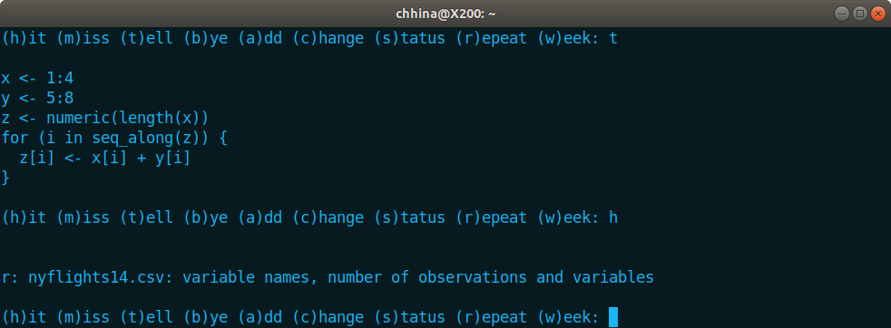
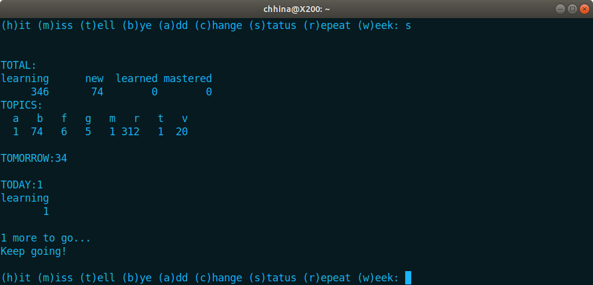
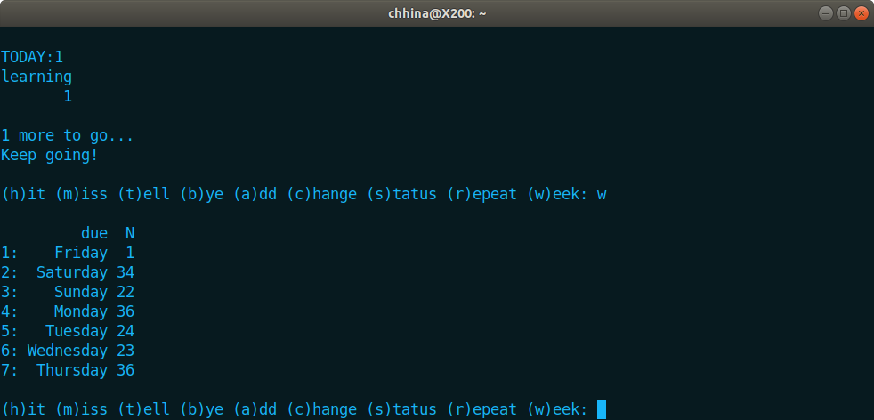
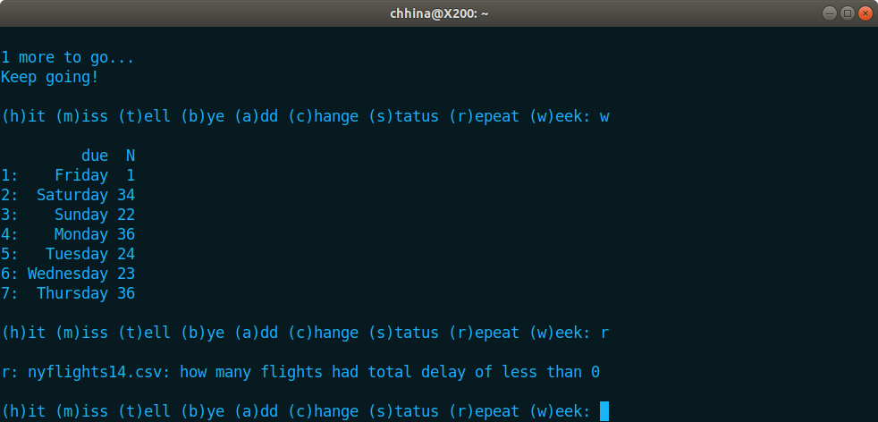
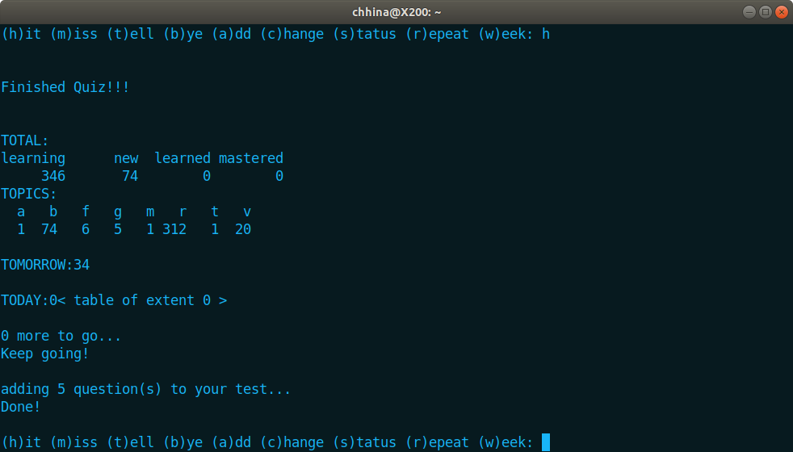
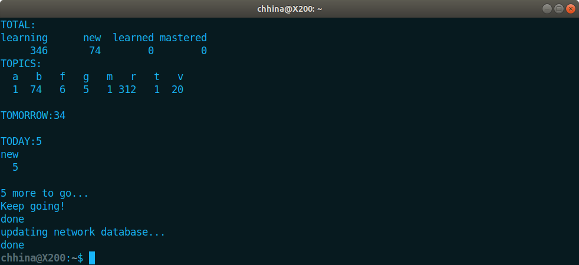

### Start autoquiz
You start the quiz by launching `autoquiz` at the terminal command prompt. Make sure the autoquiz script is in a place that is in your path environment. In my case I store my bash scripts in `~/bin` directory.

Notice that first it updates the local quizme directory (`~/.quizme`) using the remote. Then it reads the local directory to load all objects in R environment. Then the first question is presented. The first letter (r:) in the question indicates that it's an R language question. We can try to solve the problem in a separate environment (R console or RStudio).

### Show the answer
To confirm if our answer is correct we can then use `t` command to see the solution: 

### Edit a question
In the above problem, note that there was a typo in the question (grey60 was written as gre60). To edit the current question, we use `c` command:

It shows the line numbers now and allow you to add the question. Here we have to type the whole question again (it does not allow you to do a specific edit). I have not researched if there is a way to do that. Although not ideal, it gets the job done.

### Success Response
Assuming that our answer is correct, we use `h` to tell quizme that we successfully answered the question. Once we do that, it presents the next question. Most often in R, we are solving a problem related to some data. So I start my question with *\<package::dataset\>*. If the dataset is not a part of any package, I would store that in `.quizme/data` directory. In the following example, *nyflights14.csv* is stored in this directory.

### Fail Response
Let's say we do not recall the answer to this question. We will use `m` to tell quizme that we don't know the answer. Quizme poses us a new question and the missed question will be asked again soon.

### Adding a New Question
While thinking about the current question, let's assume we get distracted with some other topic that we don't know. We do a little bit of research and learn how to calculate probabilities of a normal distribution. It's good time to add our new knowledge into quizme. We do that using `a` command:

Then we continue to solve our original problem. Using `t`, we ask quizme to show us the answer so we can confirm. Assuming that our answer was correct, we use `h` again. Note that the new question is the one which we missed earlier:

### Checking Status
Ok, before we answer this question, we want to know where we are in the quiz (how many more questions to go and other stats). We will use `s` to show the status:

First the total number of questions split by status and topics is shown. In this example, I am learning 346 questions and there are 74 new questions. I have not implemented criteria to move *learning* questions to *learned* and *mastered* yet. In addition, it shows how many questions are due tomorrow (34) and how many are remaining today (1, yippie!).

### Checking Weeks Workload
Besides looking at overall statistics, we can use `w` to see workload for the whole week. It shows number of questions for each day that are due in the next 7 days. This is helpful to plan your week.

### Display the last question
Alright, after looking at these stats, I'll typically forget the question that I was supposed to be working on. Instead of scrolling up the terminal, we can use `r` to repeat the last question:

### End of Quiz
Let's say we know the answer this time. We will use `h` to tell quizme just that. Since this was our last question, 'Finished Quiz!!!' message is displayed followed by overall stats. It detects that I did not learn any new questions today and automatically adds 5 new questions from the repository.

### End of Session
Now we are really spent and plan to tackle the new questions sometime later, so we use `b` to call bye. It updates the local files first followed by updating the network files and we are done!

### Learning More

- [Quizme Introduction](../quizme-intro) for information on installation and usage without autoquiz
- [Quizme Development](../b93) on discussion of code and related functions
- [Quizme Design](../b92) on discussion on design philosophy
- [Quizme Package](https://github.com/pchhina/quizme) to install and try it!
- [Autoquiz](https://github.com/pchhina/autoquiz) to install and try autoquiz

