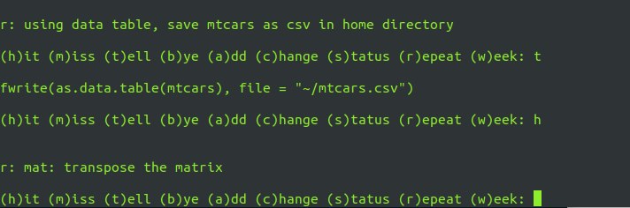

## About
This project was inspired by a [book](https://www.amazon.com/Make-Stick-Science-Successful-Learning/dp/0674729013) I read a few years back. It is a command line tool to create repository of questions and automatically schedule daily quizzes for deliberate practice based on spaced repetetion algorithm. It employs data.table to store questions and answers that enables fast re-ranking of questions based on user's responses. Since questions and answers are simple text data, you could use it to learn almost anything.

## Code
See the code [here](https://github.com/pchhina/quizme) on Github.

## What did I learn?
- [Lubridate](https://lubridate.tidyverse.org/) library
- Loading data at startup

## What can be improved?
- Lots of nested conditionals
