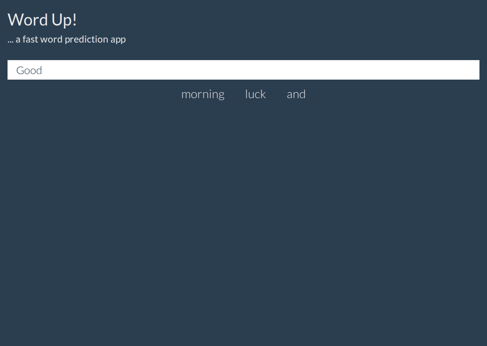

## About
This project is a web application to predict the next likely word(s) that the user intends to type. The main goal is to keep the predictions accurate yet fast for limiting the memory footprint since it is intended for mobile applications.

## Code
See the code [here](https://github.com/pchhina/wordup) on Github.

## Demo
Feel free to checkout the application [here](https://param-singh.shinyapps.io/word_prediction_app/)

## What did I learn?
- Natural Language Processing (NLP) using [n-grams](https://en.wikipedia.org/wiki/N-gram)
- [DataTable](https://rdatatable.gitlab.io/data.table/) library
- Working with multiple R files

## What can be improved?
- How to integrate it into mobile app
