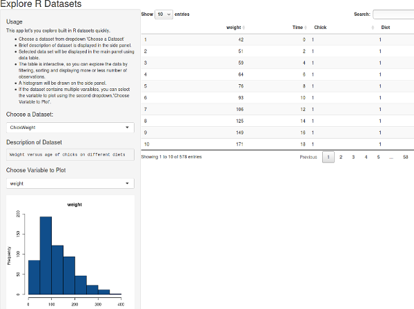

## About
R has quite a few built-in data sets that a new user can learn a lot from. Unfortunately, each time you need to look at those data sets, you have to write little code snippets to view plots/tables for understanding. This application comes to your rescue by pulling the available data sets in drop-down menus with plots and summary tables.

## Code
See the code [here](https://github.com/pchhina/rdataexplorer) on Github.

## Demo
Check this application [here](https://param-singh.shinyapps.io/r_data_explorer/)

## What did I learn?
- Building Shiny apps

## What can be improved?
- Search datasets from external libraries
