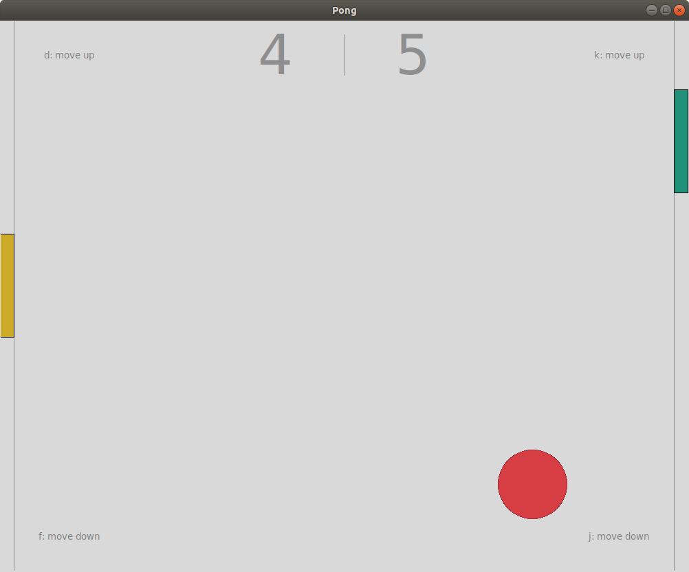

## About
Game of pong built using Tkinter. If the ball hits the gutter instead of paddle, the opponent scores a point. If the player is successful at blocking the ball with paddle, the ball bounces off the paddle towards the opponent at a slightly higher speed. Key pairs (f, d) and (j, k) are used to move both paddles to make contact with the ball.

## Code
See the code [here](https://github.com/pchhina/interactive-programming/tree/master/pong) on Github.

## What did I learn?
- [Tkinter](https://docs.python.org/3/library/tkinter.html) Library
- Using classes in Python

## What can be improved?
- Adding mouse interactivity
