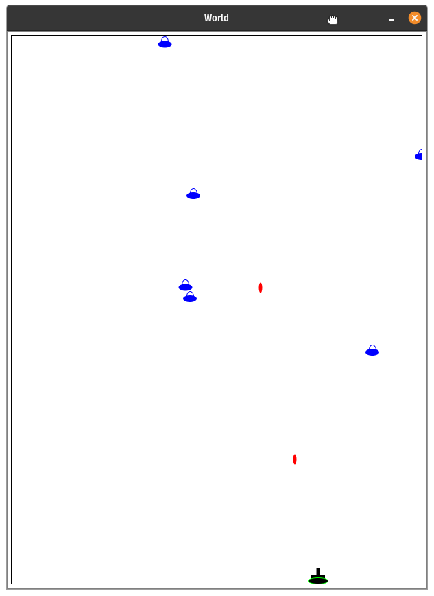

## About
A classic game of space invaders built using programming design principles. Arrow keys are used to move the tank sideways while space key is used to shoot the aliens. 

## Code
See the code [here](https://github.com/pchhina/space-invaders) on Github.

## What did I learn?
- Program design principles including designing functions, data and worlds
- Template based design
- Designing with simple data structures

## What can be improved?
- Bounding the tank within the canvas frame
- Adding score and lives
