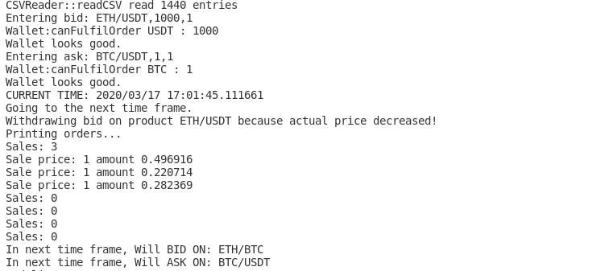

## About
A command-line application that automates the process of trading. It generates likely future exchange rates, decides when and how to generate bids and passes the bids to exchange for matching. It then processes the trade for accepted bids. Similar process is carried for offers and sell. It also maintains records for all assets, bids and offers.

## Code
See the code [here](https://github.com/pchhina/merkel) on Github.

## What did I learn?
- Object-oriented design principles in C++
- File I/O

## What can be improved?
- Speed-up for large data sets.
