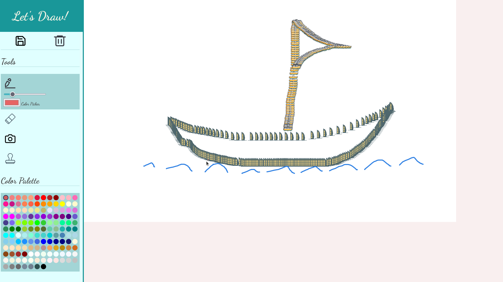

## About
A simple web-based drawing app with following features:
- Drawing tool with color picker, color palette and ability to change line thickness
- Save and delete feature
- Eraser with four different size choices
- Load and edit external image
- 11 image processing choices
- Stamping tool with 16 stamps

## Code
See the code [here](https://github.com/pchhina/drawapp) on Github.

## What did I learn?
- Front-end skills including design, layout, typography
- working with p5.js library
- write image processing code

## What can be improved?
- add undo feature
